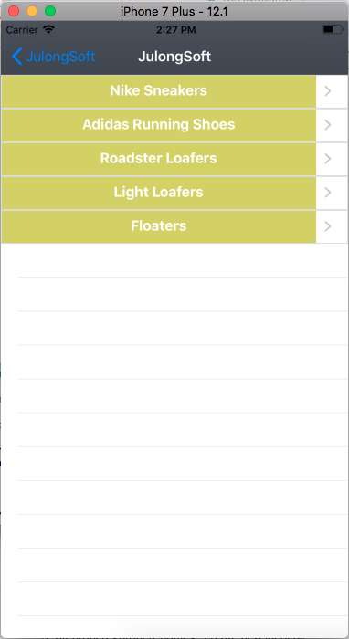

# JulongSoft
In Home Page collectionView displaying Category list. When user select any category item  it display product list in tableview and added floating dropdown tableview to display in variants.

## Dependencies:
1. XCODE 8.2+
2. Compatible simulator

## Technologies:
1. XCODE 9.3
2. Swift 4.1

## Third Party Libraries
1. Almofire ~> 4.2.0
2. SwiftyJSON
3. ATDraggableDynamicAnimator

## MIT License

